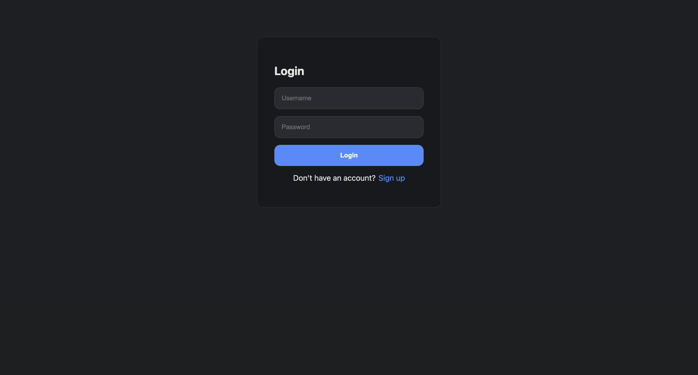
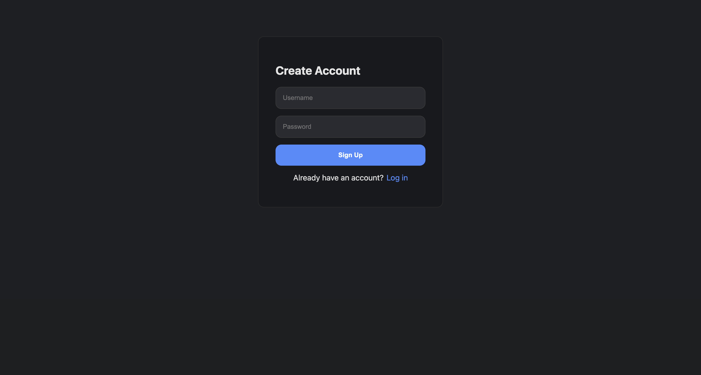
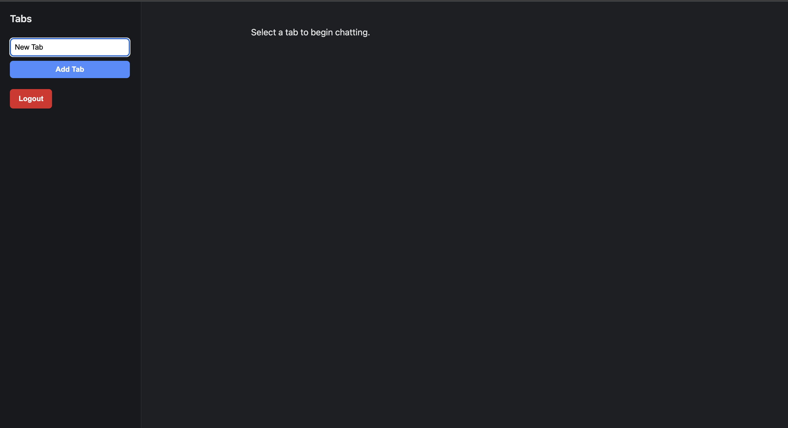
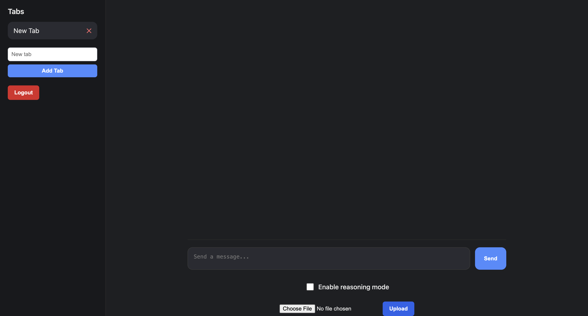
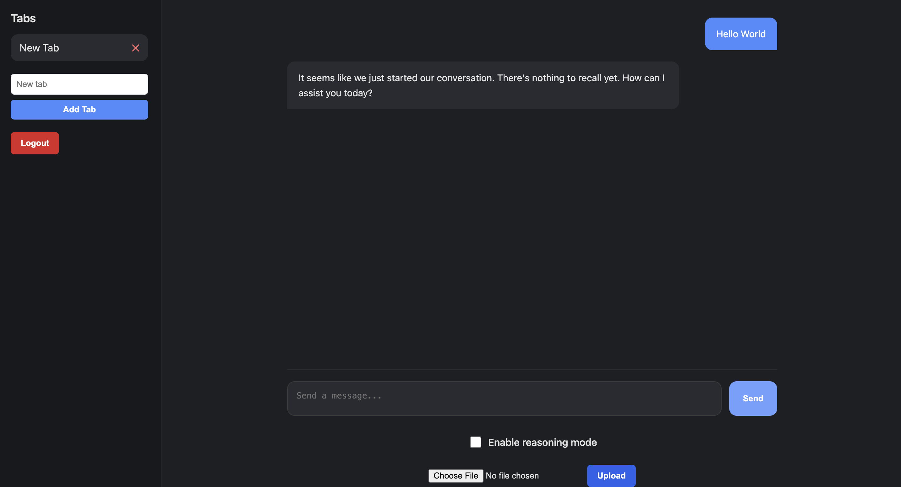
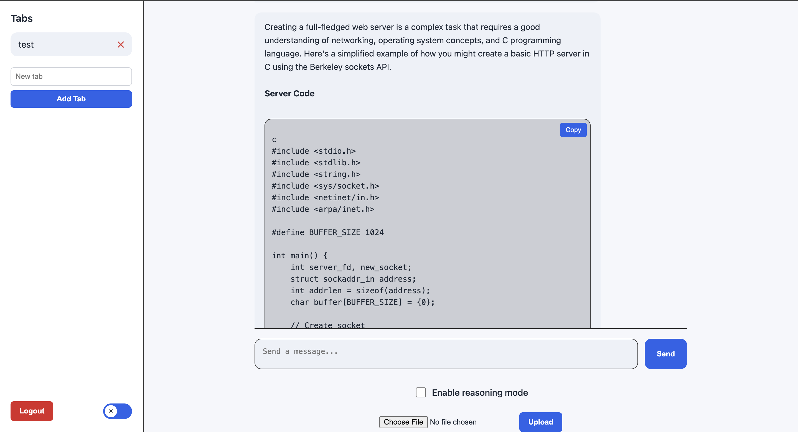

# Context-Aware-Frontend 
This is the frontend to go along with this Context-Aware-Ai. In this frontend, a user may log in or sign up  and then will be able to see all tabs they have. You need to download Context-Aware-Ai and follow setup steps before running this application.

## Where to get Context-Aware-Ai 
1. Go to my github [github/timkrans/Context-Aware-Ai](https://github.com/timkrans/Context-Aware-AI) or run 
    ```
    git clone https://github.com/timkrans/Context-Aware-AI
    ```
2. Read the readme to setup
3. Start serving both the front and backend servers

## Ways to run server
### Dev Server 
This frontend uses vite as a frontend so you can just run it as a dev.
1. Run
    ```
    npm run dev
    ```

### C-Server
I have created a C-Server if you wish to build and run the frontend on that.

1. Run
    ```
    npm run build
    ```
This will create a dist directory.

2. Go to my github:[https://github.com/timkrans/C-Server](https://github.com/timkrans/C-Server) or 
    ```
    git clone https://github.com/timkrans/C-Server
    ```
3. Create a folder in the repo called public and move all the content inside the dist in there
4. Inside the repo run 
    ```
    make
    ```
5. Run the object file it created 
    ```
    ./server
    ```
    It should output
    ```
    Serving static files from ./public
    http://localhost:8080
    ```

## Images of the frontend
1. Log in

2. Sign up

3. Adding Tab

4. Clicked on Tab

5. Response from AI

6. Light mode with copyable code and bold text
)

## Future enhancements
- Agent hookup 